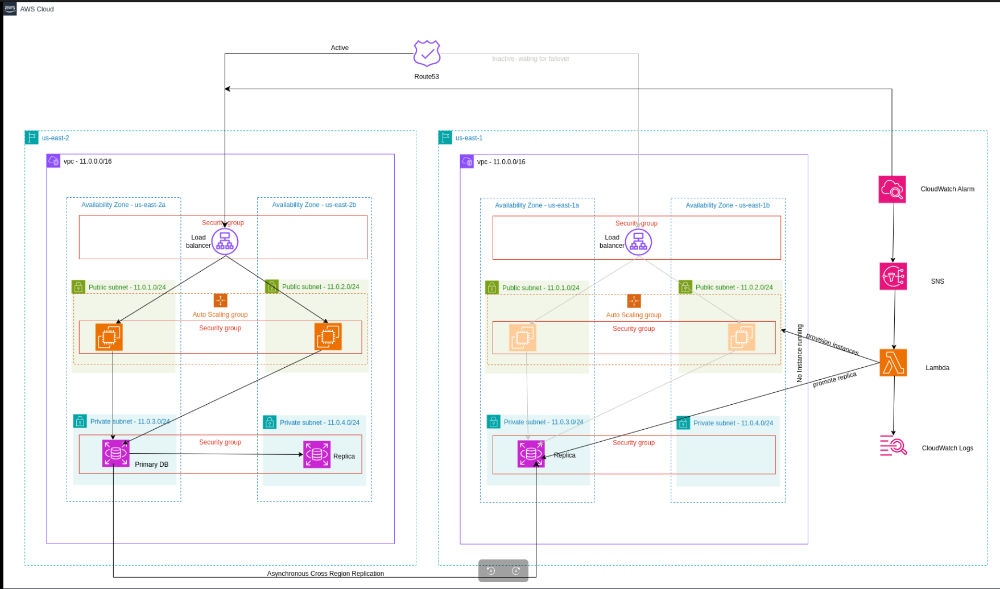

# ⚡ Disaster Recovery Solution Using Pilot Light Strategy (Terraform)

This project provides a Terraform-based disaster recovery (DR) solution using the **Pilot Light Strategy**. It ensures high availability and quick recovery of critical AWS resources (EC2, RDS, S3, and Lambda) with minimal operational overhead and cost.

---

## 🎯 Objective

To create an automated, cost-effective disaster recovery architecture that minimizes downtime and ensures availability of essential services across AWS regions.
---

## Project Architecture



## 🧠 How It Works

1. **Two Regions** are configured:
   - **Primary Region**: Fully active with production resources.
   - **Secondary Region**: Contains a minimal "pilot light" version of the environment.

2. **Route 53 Failover Routing**:
   - **Primary record** points to the **ALB (Application Load Balancer)** in the **primary region**.
   - **Secondary record** points to the **ALB in the secondary region**.
   - A **Route 53 health check** monitors the ALB in the primary region.

3. **Failover Automation**:
   - If the primary ALB becomes **unhealthy**, the **CloudWatch alarm** triggers an **SNS topic**.
   - **SNS** invokes a **Lambda function** that:
     - Promotes the **RDS Read Replica** in the secondary region.
     - Launches **EC2 instances via Auto Scaling Group**.
     - Updates secrets in **AWS Secrets Manager** (e.g., new DB connection string).

---
## 🔑 Key Concepts

- **Pilot Light Strategy**: Keep a bare-minimum version of the production stack running (or in a stopped state) in a secondary AWS region.
- **Terraform IaC**: Use Terraform to provision and manage all disaster recovery resources.
- **Core AWS Services**: Focus on EC2, RDS, and Lambda only.

---

## 🧱 Key AWS Components

### ☁️ EC2 (Compute)
- Pilot light EC2 configuration in DR region.
- No Instances running until triggered.
- Auto Scaling Group is defined in Terraform for rapid scaling.

### 🛢️ RDS (Database)
- Cross-region **Read Replica** maintained.
- Promoted to **primary** during failover.

### 📦 S3 (Storage)
- Cross-Region Replication (CRR) between production and DR buckets.
- Versioning and lifecycle policies enabled.

### ⚙️ Lambda (Orchestration)
- Lambda function:
  - Promotes RDS.
  - Spawns EC2 instances.
  - Updates Secrets Manager.
- Triggered by SNS upon CloudWatch alarm.

### 🧭 Route 53 (DNS)
- **Failover Routing Policy** for traffic redirection.
- Health checks attached to the primary ALB.

---

## 🛠️ Setup Instructions

### 📦 Prerequisites
- Terraform CLI
- AWS CLI
- IAM credentials with permissions for EC2, RDS, S3, Lambda, and CloudWatch


1. **Clone the Repository:**
   ```bash
   https://github.com/BINAH25/terrform-disaster-recovevy.git
   terrform-disaster-recovevy

### ⚙️ Deploy PRIMARY Infrastructure

```bash
cd primary
# Initialize Terraform
terraform init

# Review execution plan
terraform plan

# Deploy infrastructure
terraform apply
```

### ⚙️ Deploy DR Infrastructure

```bash
# Initialize Terraform
terraform init

# Review execution plan
terraform plan

# Deploy infrastructure
terraform apply
```